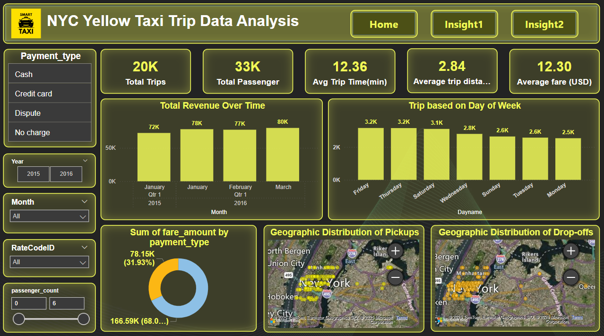

# NYC Yellow Taxi Trip Data Analysis

## Project Overview
This project analyzes NYC Yellow Taxi trip data to uncover key trends and insights related to trip volume, passenger behavior, fare distribution, and revenue patterns. Using **Python** for data processing and **Power BI** for visualization, we provide an interactive dashboard highlighting critical aspects of taxi operations in NYC.

## Tech Stack
- **Python**: Data handling and compression for large datasets.
- **Power BI**: Data visualization and dashboard creation.

## Dashboard Screenshots
Below are screenshots of the Power BI dashboards:

## Data Insights
### Dashboard 1: Overview of Taxi Trips
#### 1. Total Trips and Passengers
- **Insight**: 20,000 total trips and 33,000 total passengers.
- **Interpretation**: Indicates shared rides or family/group travel trends.

#### 2. Average Trip Time and Distance
- **Insight**: 
  - Average trip time: 12.36 minutes
  - Average trip distance: 2.84 miles
- **Interpretation**: Typical short-distance urban taxi operations in NYC.

#### 3. Average Fare Amount
- **Insight**: Average fare is **$12.30**, indicating affordability.

#### 4. Total Revenue Over Time
- **Insight**: Revenue peaked in **March ($80K)**, showing an increasing trend.
- **Interpretation**: Seasonal or operational factors may be influencing revenue growth.

#### 5. Trips by Day of the Week
- **Insight**: 
  - **Thursday and Saturday** have the highest trips (~3.2K)
  - **Monday and Tuesday** have fewer trips (~2.5K)
- **Interpretation**: Higher demand on weekends and late weekdays suggests nightlife and event-related travel.

#### 6. Sum of Fare Amount by Payment Type
- **Insight**: 
  - **Credit cards** dominate (67.7%)
  - **Cash payments** account for (31.8%)
- **Interpretation**: Increasing preference for digital payments.

#### 7. Geographic Distribution of Pickups and Drop-offs
- **Insight**: Highest density in **Manhattan**, followed by Brooklyn and Jersey City.
- **Interpretation**: NYC business centers and tourist spots drive high taxi demand.

### Dashboard 2: Deeper Analysis
#### 1. Trip Distance vs. Tip Amount
- **Insight**: Longer trips receive higher tips.
- **Interpretation**: Higher customer satisfaction for longer rides.

#### 2. Longest Trips by Vendor
- **Insight**: Vendor 2 handles longer trips more often than Vendor 1.
- **Interpretation**: Vendor 2 may focus on airport or suburban routes.

#### 3. Most Frequent Rate Code
- **Insight**: Standard rate is most common; few trips involve airport surcharges.

#### 4. Average Tip Amount by Payment Type
- **Insight**: Credit card payments have higher tip amounts.
- **Interpretation**: Digital payments encourage tipping via pre-set suggestions.

#### 5. Average Trip Distance by Month
- **Insight**: Slight increase in average trip distance from January (2.8 miles) to March (3.0 miles).
- **Interpretation**: Seasonal changes or increased tourism may be factors.

#### 6. Peak Hours for Pickups and Drop-offs
- **Insight**: Peak demand from **6 PM - 9 PM**, with a decline in early mornings.
- **Interpretation**: Demand aligns with work commutes, social events, and dining.

#### 7. Total Revenue by Pickup Hour
- **Insight**: Highest revenue between **6 PM - 9 PM** and **morning rush hours (7 AM - 10 AM)**.

## Conclusion
This analysis provides actionable insights for NYC Yellow Taxi services:
- **Digital Payments**: Credit cards dominate, reflecting a shift toward cashless transactions.
- **Peak Demand**: Thursdays, Saturdays, and evening hours have the highest trip volumes.
- **Geographic Concentration**: Most trips occur in **Manhattan**.

## Contributors

- **Saurabh Tehare** - Data Analysis & Visualization

Open to Contributions! Feel free to raise issues or submit pull requests.
